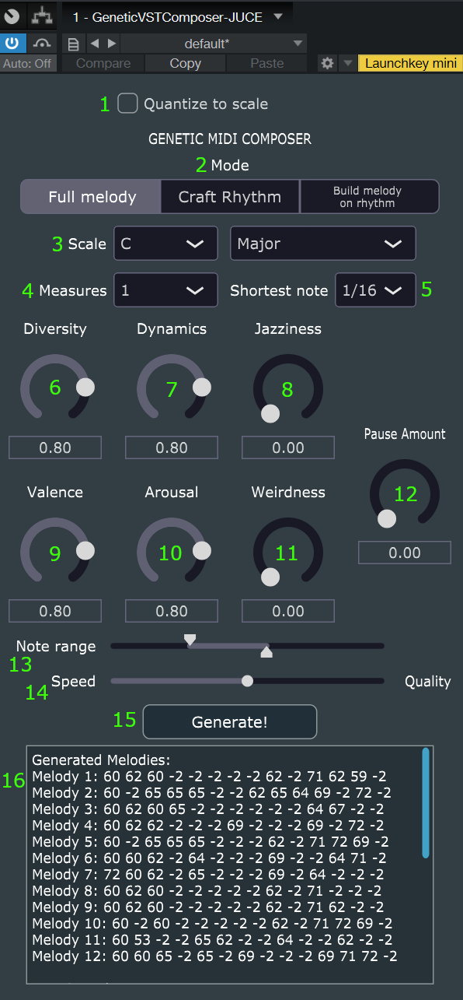

# GeneticVSTComposer

Interactive VST Plugin composing tool for generating short melodic lines using genetic algorithms. Plugin is desired to work as a MIDI Effect, which enables user to to quickly generate and modify melody ideas in any time signature / scale, using desired qualities like number of dissonances or chord conformance, as well as control parameters / automation of the instruments. 

## Concept
1. The user defines basic parameters, such as scale, time signature, length of a pattern, amount of dissonant intervals, dynamics, tonal range, which serve as evaluation metrics for algorithm's fitness function. Search for innovative metrics can be considered.
2. For given number of generations, the best solutions are created.
3. Best solution melodies can be trigerred by specific MIDI keys, similarly to NI Kontakt libraries. They can as well be further crossovered and mutated according to user's preferences. MIDI can as well be dragged into a track and modified.
4. For specific range of MIDI notes, created riff / melody can be played with different pitches, which should be able to fit to scale if desired.
5. (to be considered) apart from MIDI generation, controlling / automating parameters of vst instruments can be considered. Alternative idea could be building a simple synthesizer, parameters of which (filters, LFO, effects etc.) can also be optimized by genetic algorithm.

## Previous works
VST (Virtual Studio Technology) plugins are software components that can be integrated into digital audio workstations (DAWs) and other compatible software for music production. These plugins extend the functionality of the host software by providing additional effects, instruments, and processing capabilities.

There exist a fair amount of VST plugins designed to help musicians in their creative process. Some of them involve simple music theory tools [1], allowing to explore variety of chords and scales in creative process. Some modern plugins use advanced AI models for generation, allowing them to introduce innovative functionalities. There are a few positions on the market that are worth mentioning. There is a set of 5 AI tools from Google called Magenta Studios, which allow to completely transform existing melodies and drum patterns [2]. A plugin called Synplant allows to create synth patches from audio recordings provided by the user [3]. Another tool called Orb Producer Suite allows for chord / melody generation, quick randomization of patterns and their customization [4]. InstaComposer 2 [11] offers DAW-like interface for creating multiple tracks in different modes using chosen scales. WavTool [12] has similar approach, but uses LLM in creative process to help choosing presets or scales.

Music generation models based on neural networks are fairly effective, but their limitations are lack of controllability and restriction to dominant musical structures, like 4/4 common time signature [5]. Alternative approach might be using genetic algorithms, which are based simply on optimization of the melody, rather than predicting consecutive notes based on learned data. The biggest challenge for building a genetic algorithm is creating a fitness function to evaluate quality of the created melodies. One approach is user evaluating melodies based on their preference, as presented in widely cited GenJam [6] work. However, using that approach is very time consuming, as it requires user evaluating all members of population for every generation. For many years research has been conducted concerning finding appropriate fitness function. Many of works use music theory rules as a source of evaluation. [7,9] measure qualities such as amount of dissonances or scale conformance in the melody, when [7,8] use statistical criteria to find the distance between qualities measured in generated melody and the same qualities in real pieces. [5] used that approach to evaluate melodies according to desired mood, playing style and composition parameters, which are predicted from text using LLM. There are also another approaches worth analysing, such as using sequence models like LSTM as a fitness function for genetic algorithm [10].

To our best of knowledge, there is not yet a VST plugin that uses genetic algorithms for the task of MIDI generation, at least not in a way we proposed. We also did not find an approach that concerns generating rhythm and melody seperately, which we find to have a great potential in creative process.

## Schedule (tasks to be finished by the end of given week)
- 04.03 - 10.03 - Concept proposal, literature analysis, planning
- 11.03 - 17.03 - creating issues for accepted schedule, experiementing and choosing framework for VST creation, framework functionality analysis
- 18.03 - 24.03 - Basic VST plugin (no functionality yet)
- 25.03 - 31.03 - Implementation of basic genetic algorithm
- 01.04 - 07.04 - Integration of the basic genetic algorithm and VST -> Basic VST prototype with basic functionality (1st milestone)
- 08.04 - 14.04,\
  15.04 - 21.04 - Development of UI, improving functionality of genetic algorithm, optimization
- 22.04 - 28.04 - Research about potential sonification of MIDI (i.e. ability to control different MIDI signals on other vst instruments or synthesizer controlled by GA)
- 29.04 - 05.05 - break (nothing)
- 06.05 - 12.05,\
  13.05 - 19.05 - working on sonification (and its control), improving UI functionality for more controllable and intuitive generation
- 20.05 - 26.05,\
  27.05 - 02.06 - Testing
- 03.06 - 09.06 - Documentation, user's instruction
- 10.06 - 16.06 - Final documentation and video

## Planned experiements
- analysis of algorithm's ability to converge to the best solutions
- testing VST in DAW
- Composing a song using the VST

## Technological stack
- JUCE / Neutone
- C++ / Python

## Status of completion

The plugin in its current state has almost exact functionalities as described in points 1-4 of the concept. The plugin works as MIDI Effect, which has various modes of generation and is capable of generating melodies on the basis of user-controlled parameters. Melodies can be invoked and transposed using different keys, which can be usable live. We did not realize the optional point 5 regarding controlling parameters of VST instruments, as based on analysis of papers we doubted in quality of such an experiment. Besides, as the plugin works as an MIDI Effect, we found that such additional functionality might be redundant and not used, so we decided to focus directly on MIDI functionality of the plugin.

## Compiling and running the plugin
- In order to be able to compile vst3 plugin, you need to have JUCE installed. You can download it from [JUCE website](https://juce.com/). After installing JUCE, you can open the project in Projucer and compile it. After compiling, you will find the vst in Debug folder. You can also just download the vst3 file from releases in this repository.
- In order for the plugin to be visible in DAW, you need to copy the vst3 file to the folder where your DAW is looking for plugins. For most cases the location should be `C:\Program Files\Common Files\VST3`. After copying the file, you need to restart the DAW. The plugin should be visible in the MIDI Effects or Effects section.
- For MIDI Effect to work with desired instruments, you need to route the MIDI signal from the plugin to the instrument. In most DAWs you can do it by creating a new MIDI track, setting the input of the track to the MIDI Effect and the output to the instrument. Refer to the DAW documentation for more information.

## How to use the plugin

1. **Quantize to scale**: when it is on, all notes of invoked / transposed melodies are snapped to the closest note of the chosen scale.
2. **Mode**:
   - **Full melody**: Generates 12 different melodies based on provided melodies. Keys from C3 to B3 invoke the melodies, keys from C4 up transpose the melodies in real time.
   - **Craft Rhythm**: Generates 12 sequences based only on rhythm metrics and mutations. Keys from C3 to B3 invoke the sequences. All notes are of the same pitch.
   - **Build melody on rhythm**: Takes the rhythm of the last invoked sequence and generates a melody over it, so that all melodies have the same rhythms, but different pitches. Best used with Craft Rhythm mode. Keys from C3 to B3 invoke the melodies, keys from C4 up transpose the melodies in real time.
3. **Scale**: Choose musical scale to be used for GA optimization and scale quantizing.
4. **Measures**: How long sequence will be played before it repeats.
5. **Shortest note**: Shortest possible note to be encoded (recommended 1/16).

6. **Diversity**: High value influences occurence of high amount of unique pitches, intervals and rhythmic values.
7. **Dynamics**: High value influences changes in rhythmic values, increase in pitch range, pitch variation and playing close notes one after the other.
8. **Jazziness**: High value influences occurence of dissonant intervals, less reliance on the musical scale, playing short consecutive notes.
9. **Valence**: Has proportional impact on amount of non-dissonant intervals, influences melodic contour to be pointed up, and average pitch to be higher.
10. **Arousal**: High value influences playing fast notes, playing notes with wide pitch range, and with high average pitch.
11. **Weirdness**: High value influences playing long notes off-beat, intervals over octave to appear.
12. **Pause Amount**: Has proportional impact on desired amount of pauses in the melody.

13. **Note range**: Specifies the range of used notes in octaves. The range starts from the first note of chosen scale in the octave specified by the left slider and ends on the first note of chosen scale one octave above the one specified by the right slider.
14. **Speed / Quality**: Regulates the size of population and number of generations in genetic algorithm. Higher values should make generations better, but longer.
15. **Generate**: Invokes generation of new melodies.
16. **Generated Melodies**: Shows the list of currently generated melodies with their MIDI values. -1 means pause, -2 means extension of the previous note.

## Future work

The plugin can be further developed in the following ways:
- MIDI drag and drop functionality could be added, so that the generated MIDI can be easily placed in DAW and saved. In current state, the generated MIDI is forgotten, when generating new melodies, so it works better live than for actual composing.
- A feedback mode could be created, when user can evaluate the generated melodies and on the basis of that evaluation new melodies would be created. As the process of evaluation is time consuming, it could be done in a way that user evaluates only the best melodies, which were already obtained in previous generations with current fitness function. Feedback could be also used in generating rhythms, which would be probably easier.
- Some functionality of recording user's rhythm input and then optimizing melody on that rhythm could be added, just as it works in our "Build melody on rhythm" mode.
- The genetic algorithm efficiency can be further optimized to obtain solutions quicker
- Using neural networks as a part of fitness function could be considered, as it was done in [10]
- Plugin's UI could be improved for better user experience. In particular, a keyboard visualisation could be added to clearly show roles of specific keys.
- Generated melodies could be shown in UI in form of music notation and also modified on the go.

## Bibliography
[1] Scaler 2. https://www.scalerplugin.com/. Access: 10.03.2024\
[2] Magenta Studio. https://magenta.tensorflow.org/studio/. Access: 10.03.2024\
[3] Synplant. https://soniccharge.com/synplant/. Access: 11.03.2024\
[4] Orb Producer Studio 3. https://www.orbplugins.com/orb-producer-suite/. Access: 11.03.2024\
[5] Poćwiardowski J., (2023). System for synthetizing music from users description [Unpublished bachelor’s thesis]. Gdańsk University of Technology.\
[6] Biles J. “GenJam: A genetic algorithm for generating jazz solos”. in: ICMC. T. 94. Ann Arbor, MI. 1994, p. 131–137.\
[7] Zdzisław Kowalczuk, Marek Tatara & Adam Bąk. “Evolutionary music composition system with statistically modeled criteria”. in: Trends in Advanced Intelligent Control, Optimization and Automation: Proceedings of KKA 2017—The 19th Polish Control Conference, Kraków, Poland, June 18–21, 2017. Springer. 2017, p. 722–733.\
[8] L Rocha de Azevedo Santos, Carlos Nascimento Silla Jr & MD Costa-Abreu. “A methodology for procedural piano music composition with mood templates using genetic algorithms”. in: (2021).\
[9] Michael Towsey “Towards melodic extension using genetic algorithms”. in: Educational Technology and Society (2001), p. 54–65.\
[10] Farzaneh, Majid, and Rahil Mahdian Toroghi. "GGA-MG: Generative genetic algorithm for music generation." arXiv preprint arXiv:2004.04687 (2020).\
[11] InstaComposer 2. https://www.waproduction.com/plugins/view/instacomposer-2. Access 12.03.2024\
[12] WavTool. https://wavtool.com/. Access 12.03.2024
